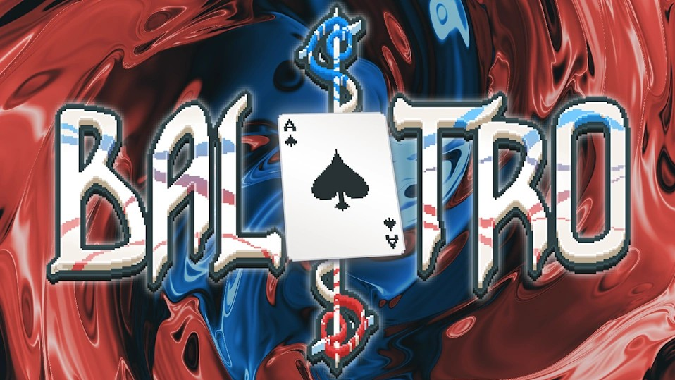

# Simulating Balatro: A Monte Carlo Analysis for Better Game Development

A Python-based simulation of [Balatro](https://store.steampowered.com/app/2379780/Balatro/), a poker-inspired roguelike card game, built to study gameplay dynamics through Monte Carlo methods. The simulation models the full game loop — deck management, hand evaluation, Joker effects, and Planet card upgrades — and runs 1,000 independent playthroughs to characterize performance distributions.

**Course:** ISYE 6644 — Simulation and Modeling for Engineering and Science, Georgia Tech (OMSA)

## Overview

Balatro tasks players with clearing escalating score targets across a series of blinds and antes. Each round, a player draws 8 cards from a shuffled 52-card deck and plays the best 5-card poker hand they can form, earning chips multiplied by a multiplier. Joker cards apply conditional bonuses, and Planet cards permanently upgrade specific hand types.

This project answers the question: *given a faithful simulation of the core game mechanics, what does typical progression look like, and how much does luck drive outcomes?*

## Game Mechanics

### Score Structure

Scores follow the formula: `Score = (Base Chips + Bonus Chips) × (Base Mult + Bonus Mult) + Face Value`

| Hand Type | Base Chips | Base Mult |
|-----------|-----------|-----------|
| Straight Flush | 100 | 8 |
| Four of a Kind | 60 | 7 |
| Full House | 40 | 4 |
| Flush | 35 | 4 |
| Straight | 30 | 4 |
| Three of a Kind | 30 | 3 |
| Two Pair | 20 | 2 |
| Pair | 10 | 2 |
| High Card | 5 | 1 |

Target scores scale with each ante: Ante 1 starts at 300/450/600 per blind and grows by 500 per ante (e.g., Ante 2: 800/950/1,100).

### Joker Cards

Up to 5 Jokers can be held simultaneously, awarded randomly (50% chance) after clearing a blind.

| Joker | Effect | Condition |
|-------|--------|-----------|
| Joker | +4 Mult | Always |
| Jolly Joker | +8 Mult | Hand is a Pair |
| Devious Joker | +100 Chips | Hand is a Straight |
| Scholar | +20 Chips, +4 Mult | Hand contains an Ace |
| Even Steven | +4 Mult | All numeric cards are even |
| Odd Todd | +31 Chips | All cards are odd (A, 3, 5, 7, 9) |
| Smiley Face | +5 Mult | Hand contains a face card (J, Q, K) |
| Shoot the Moon | +13 Mult | Hand contains a Queen |
| Mad Joker | +10 Mult | Hand is Two Pair |
| Abstract Joker | +3 Mult per Joker held | Always |

### Planet Cards

Up to 4 Planet cards can be held, each permanently upgrading a specific hand type. Awarded randomly (50% chance) after clearing a blind.

| Planet | Hand Upgraded | Bonus |
|--------|--------------|-------|
| Pluto | High Card | +1 Mult, +10 Chips |
| Mercury | Pair | +1 Mult, +15 Chips |
| Uranus | Two Pair | +1 Mult, +20 Chips |
| Venus | Three of a Kind | +2 Mult, +20 Chips |
| Saturn | Straight | +3 Mult, +30 Chips |
| Jupiter | Flush | +2 Mult, +15 Chips |
| Earth | Full House | +2 Mult, +25 Chips |
| Mars | Four of a Kind | +3 Mult, +30 Chips |
| Neptune | Straight Flush | +4 Mult, +40 Chips |

### Discard Mechanic

If the best available 5-card hand from 8 drawn cards is a **Pair**, the simulation discards the non-pair cards and redraws to try for a better hand. If it is a **High Card**, the entire hand is redrawn. Each blind allows a maximum of **5 plays** before the game ends.

## Simulation Design

### Architecture

- **`card` / `Deck` classes** — represent a standard 52-card deck with shuffle and draw operations
- **`evaluate_hand`** — classifies a 5-card hand into one of 9 poker hand types
- **`best_five_of_eight`** — exhaustively evaluates all C(8,5) = 56 combinations to select the optimal play
- **`apply_jokers`** — applies all active Joker bonuses conditional on the current hand
- **`apply_planet`** — permanently upgrades a hand type's chips/mult when a Planet card is earned
- **`lets_go_balatro`** — the full simulation loop across antes, blinds, and plays

### Monte Carlo Study

1,000 independent games are run with `verbose=False` to collect distributions over:
- Antes cleared
- Blinds cleared
- Total cumulative score
- Final chips/mult per hand type (after all Planet upgrades)
- Joker and Planet acquisition frequencies

## Results

### Performance Across 1,000 Simulations

| Metric | Mean | 95% Confidence Interval |
|--------|------|------------------------|
| Antes Cleared | 2.70 | (2.50, 2.89) |
| Blinds Cleared | 9.13 | (8.55, 9.70) |
| Score Obtained | 22,185 | (20,095, 24,275) |

### Average Final Hand Values (after Planet upgrades)

| Hand | Avg Chips | Avg Mult |
|------|-----------|----------|
| Straight Flush | 110.32 | 9.03 |
| Four of a Kind | 67.35 | 7.74 |
| Full House | 46.90 | 4.55 |
| Flush | 38.89 | 4.52 |
| Straight | 37.41 | 4.74 |
| Three of a Kind | 34.92 | 3.49 |
| Two Pair | 25.14 | 2.26 |
| Pair | 13.83 | 2.26 |
| High Card | 7.75 | 1.28 |

### Key Findings

- The simulation consistently reaches Antes 2–3 on average, confirming that score targets become a meaningful bottleneck around mid-game
- Planet card upgrades measurably compound over the course of a run — Straight Flush chips grow from a base of 100 to ~110 on average, reflecting partial upgrade accumulation
- The wide confidence interval on cumulative scores (~±2,000 around the mean) quantifies the high variance inherent to the roguelike format

## Sample Simulation Output

Below is an example snippet of what the simulation output looks like for one run of the Balatro game:

```text
/\/\/\/\/\ Starting Ante 1 /\/\/\/\
Active Jokers: ['None']
Active Planets: ['None']

Ante 1, Blind 1, Target: 300
Play 1: Full House | Chips: 40, Mult: 4, Score: 196 | Running Total: 196 | Cards left in deck: 31 | Redraw: Yes
Play 2: Two Pair | Chips: 20, Mult: 2, Score: 73 | Running Total: 269 | Cards left in deck: 27 | Redraw: Yes
Play 3: Two Pair | Chips: 20, Mult: 2, Score: 78 | Running Total: 347 | Cards left in deck: 16 | Redraw: Yes
Cleared target 300 with cumulative score 347 in 3 plays.

Ante 1, Blind 2, Target: 450
Play 1: Two Pair | Chips: 20, Mult: 2, Score: 87 | Running Total: 87 | Cards left in deck: 38 | Redraw: Yes
Play 2: Flush | Chips: 35, Mult: 4, Score: 181 | Running Total: 268 | Cards left in deck: 33 | Redraw: No
Play 3: Two Pair | Chips: 20, Mult: 2, Score: 76 | Running Total: 344 | Cards left in deck: 28 | Redraw: No
Play 4: Two Pair | Chips: 20, Mult: 2, Score: 76 | Running Total: 420 | Cards left in deck: 23 | Redraw: No
Play 5: Full House | Chips: 40, Mult: 4, Score: 204 | Running Total: 624 | Cards left in deck: 18 | Redraw: No
Cleared target 450 with cumulative score 624 in 5 plays.

New Joker obtained: Devious Joker
New Planet obtained: Mars

Ante 1, Blind 3, Target: 600
Play 1: Two Pair | Chips: 20, Mult: 2, Score: 78 | Running Total: 78 | Cards left in deck: 44 | Redraw: No
Play 2: Straight | Chips: 130, Mult: 4, Score: 571 | Running Total: 649 | Cards left in deck: 33 | Redraw: Yes
Cleared target 600 with cumulative score 649 in 2 plays.

/\/\/\/\/\ Starting Ante 2 /\/\/\/\
Active Jokers: ['Devious Joker', 'Shoot the Moon']
Active Planets: ['Jupiter', 'Mars']
```

## Project Structure

```
├── Simulating Balatro - Code.ipynb                                            # Simulation code and analysis
├── Simulating Balatro - Monte Carlo Analysis for Better Game Development.pdf  # Written report
└── README.md
```

## Requirements

```
pip install numpy scipy matplotlib
```

The simulation uses only the Python standard library plus `numpy`, `scipy`, and `matplotlib`.

## Running the Simulation

Open `Simulating Balatro - Code.ipynb` in Jupyter and run cells top to bottom. To run the Monte Carlo study, execute the cell under **Run 10,000 simulations of Balatro** — this runs 1,000 games silently and generates the summary statistics and plots.

## Author

Calvin Choi
